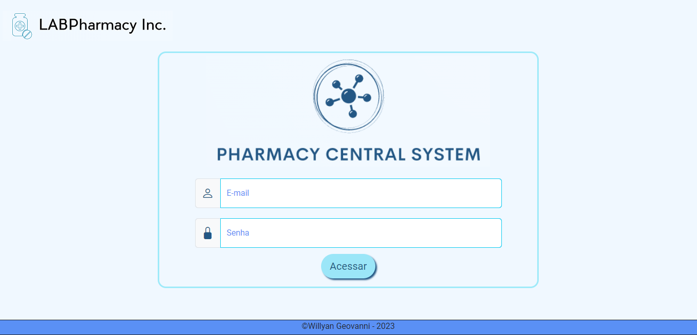
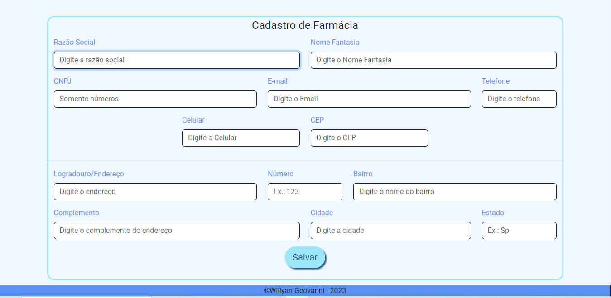
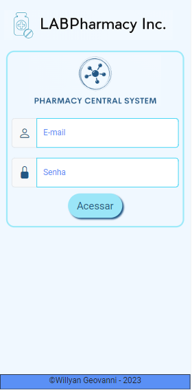
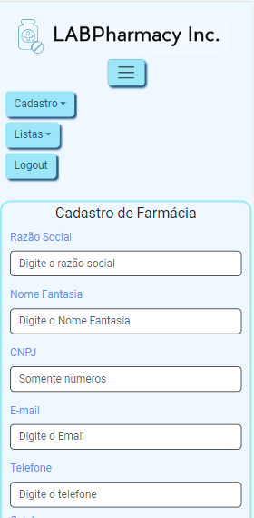

<h1 align="center">Pharmacy Central System</h1>

<p>Pharmacy Central System consiste em um sistema para cadastro de farmácias e medicamentos desenvolvido como Projeto Final do Módulo I do curso Fullstack organizado pelo
Senai.</p>
<p>A aplicação cadastra e mostra farmácias em um tabela podendo ser possível acessar as informações de cada uma. Assim como os medicamentos que são mostrados em cards e
apresentam as informações através de modal. Todas as páginas do sistema estão adaptadas para dispositivos mobile.</p>

<h2>Layout web</h2>



<h2>Layout Mobile</h2>


<h2>Pré-Requisitos</h2>
<p>Antes de começar é necessário ter instalado em sua máquina as seguintes ferramentas: <a href="https://git-scm.com">Git</a></p>
<p>O editor utilizado no desenvolvimento do sistema foi o <a href="https://code.visualstudio.com/">Visual Studio Code</a>

<h2>Para utilizar a aplicação:</h2>

```bash
# Clone este repositório
$ git clone <https://github.com/wgeovanni/ProjetoModulo1.git>

# Acesse a pasta do projeto no terminal
$ cd ProjetoModulo1

#Instale as dependências
$ npm install

# Instale a dependência bootstrap
$ npm install bootstrap

# Instale a dependência bootstrap-icons
$ npm install bootstrap-icons

# Instale a dependência react-router-dom
$ npm install react-router-dom

# Instale a dependência json-server
$ npm install json-server

# Abra o arquivo package.json e dentro da propriedade scripts adicione a linha:
 "server": "json-server --port 8080 --no-cors --watch data/dados.json",
 
 # Rode a aplicação
 $ npm run dev
```

<h2>Tecnologias Utilizadas</h2>
<p>- <a href="https://pt-br.reactjs.org/">React</a></p>
<p>- <a href="https://code.visualstudio.com/">Visual Studio Code</a></p>
<p>- <a href="https://getbootstrap.com/">Bootstrap V5.3</a>

## Licença
<p>MIT License</p>
 
## Autor

<p>Willyan Geovanni Gutierres Gonçalves</p>
